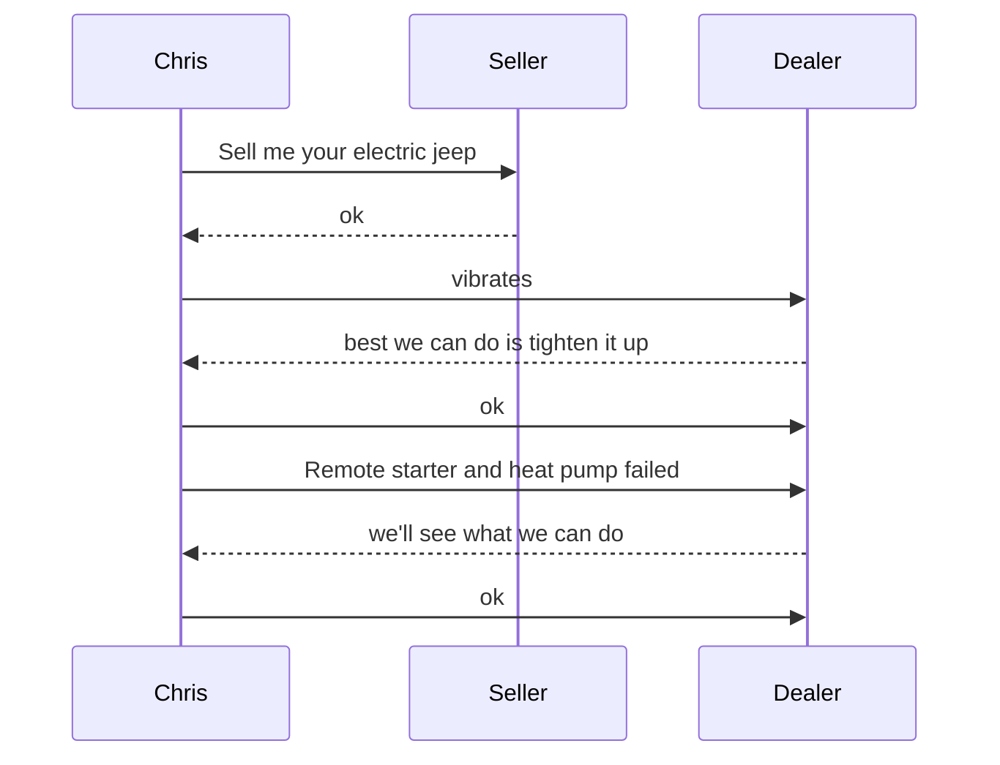

# K8S Cheatsheet

`Chris` should not have bought a `jeep`


## Conclusion
`Chris` should not have bought an `electric jeep`


 ##### Get mapped port for the dashboard
```shell
sudo kubectl get pods,svc -n kubernetes-dashboard
```
##### Get the dashboard token
```shell
sudo kubectl -n kube-system  create token admin-user
```
##### Get summarized IPv4s
```shell
ip a | grep "inet "
```
##### Get Virtualbox Host-only IP address for ssh & dashboard
```shell
ip a | grep "inet 192.168.56"
```
##### K3S Status
```shell
sudo systemctl status k3s
```
##### Quick Inventory
```shell
clear
echo "Nodes"
sudo kubectl get node -o wide
read -n 1 -r -s -p $'Press enter to continue...\n'
clear
echo "Pods"
sudo kubectl get pods --all-namespaces -o wide
read -n 1 -r -s -p $'Press enter to continue...\n'
clear
echo "Deployments"
sudo kubectl get deployment --all-namespaces -o wide
read -n 1 -r -s -p $'Press enter to continue...\n'
clear
echo "Services"
sudo kubectl get service --all-namespaces -o wide
read -n 1 -r -s -p $'Press enter to continue...\n'
clear
echo "Replica Sets"
sudo kubectl get rs --all-namespaces -o wide
read -n 1 -r -s -p $'Press enter to continue...\n'
clear
```
