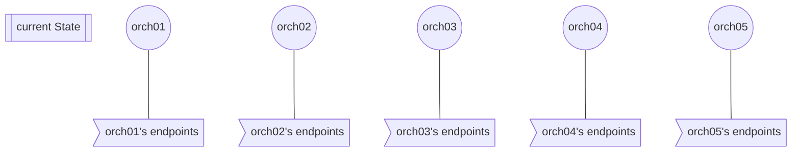
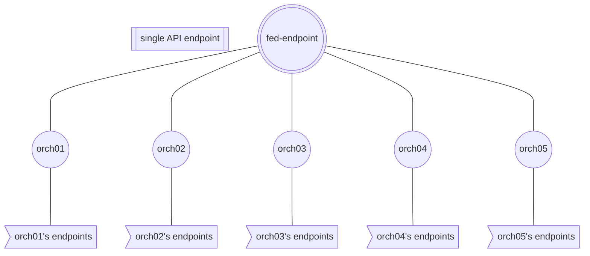

```mermaid
flowchart TD
0[[current State]]
1(("orch01")) ---- 6>"orch01's endpoints"]
2(("orch02")) ---- 7>"orch02's endpoints"]
3(("orch03")) ---- 8>"orch03's endpoints"]
4(("orch04")) ---- 9>"orch04's endpoints"]
5(("orch05")) ---- 10>"orch05's endpoints"]

```

```mermaid
flowchart TD
0[[single API endpoint]]
1(("orch01")) ---- 7>"orch01's endpoints"]
2(("orch02")) ---- 8>"orch02's endpoints"]
3(("orch03")) ---- 9>"orch03's endpoints"]
4(("orch04")) ---- 10>"orch04's endpoints"]
5(("orch05")) ---- 11>"orch05's endpoints"]
6((("fed-endpoint"))) ---- 1(("orch01"))
6((("fed-endpoint"))) ---- 2(("orch02"))
6((("fed-endpoint"))) ---- 3(("orch03"))
6((("fed-endpoint"))) ---- 4(("orch04"))
6((("fed-endpoint"))) ---- 5(("orch05"))
```
